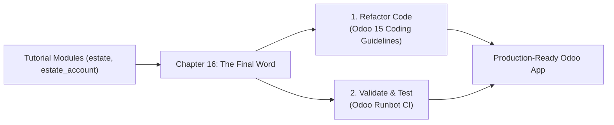
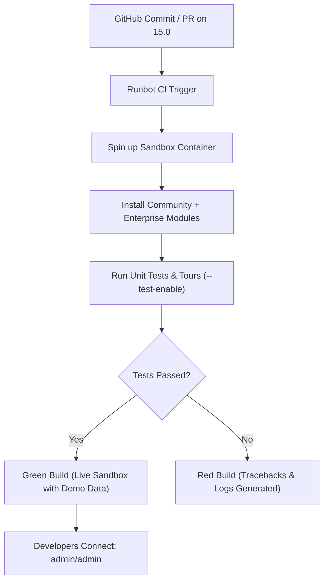

# Odoo 15 Developer Guide: The Final Word & Runbot Mastery

> **Reference Sources**:
> - Odoo 15 Official Tutorial: [Chapter 16: The final word](https://www.odoo.com/documentation/15.0/developer/tutorials/getting_started/16_final_word.html)
> - Odoo 15 Official Guidelines: [Contributing & Coding Guidelines](https://www.odoo.com/documentation/15.0/contributing/development/coding_guidelines.html)
> - Odoo Continuous Integration: [Odoo Runbot](https://runbot.odoo.com/)

---

## Table of Contents
1. [Overview & Tutorial Conclusion](#1-overview--tutorial-conclusion)
2. [Part 1: Odoo 15 Official Coding Guidelines](#2-part-1-odoo-15-official-coding-guidelines)
   - [2.1 Module Directory Layout & Permissions](#21-module-directory-layout--permissions)
   - [2.2 File Naming Conventions](#22-file-naming-conventions)
   - [2.3 XML Architecture & Best Practices](#23-xml-architecture--best-practices)
   - [2.4 XML ID Naming Conventions](#24-xml-id-naming-conventions)
   - [2.5 View Inheritance Guidelines](#25-view-inheritance-guidelines)
   - [2.6 Python & PEP8 Standards (Odoo 15 Exemptions)](#26-python--pep8-standards-odoo-15-exemptions)
   - [2.7 Strict Model Attribute Ordering](#27-strict-model-attribute-ordering)
   - [2.8 Method Naming & Ensure One](#28-method-naming--ensure-one)
   - [2.9 ORM Idioms & Golden Rules](#29-orm-idioms--golden-rules)
   - [2.10 Translation `_()` Rules](#210-translation-_-rules)
3. [Part 2: Real-World Refactoring Audit (`estate` Module)](#3-part-2-real-world-refactoring-audit-estate-module)
   - [3.1 Issues Identified in Tutorial Code](#31-issues-identified-in-tutorial-code)
   - [3.2 Before & After Refactored Code](#32-before--after-refactored-code)
4. [Part 3: Mastering Odoo Runbot for Odoo 15](#4-part-3-mastering-odoo-runbot-for-odoo-15)
   - [4.1 What is Runbot?](#41-what-is-runbot)
   - [4.2 Navigating the Odoo 15 Matrix](#42-navigating-the-odoo-15-matrix)
   - [4.3 Connecting to Live Builds](#43-connecting-to-live-builds)
   - [4.4 Debugging & Testing Workflows](#44-debugging--testing-workflows)
   - [4.5 Running Local CI Tests (Runbot Simulation)](#45-running-local-ci-tests-runbot-simulation)
5. [Summary Checklist](#5-summary-checklist)

---

## 1. Overview & Tutorial Conclusion

In the official Odoo 15 Developer Tutorial (*Getting Started*), Chapters 1 through 15 walk developers through building a complete real-estate management module (`estate`) and extending standard invoicing (`estate_account`).

**Chapter 16: "The final word"** acts as the graduation step. It transitions a developer from building tutorial exercises to writing production-ready, clean, maintainable, and standard-compliant Odoo applications. It focuses on two core pillars:
1. **Refactoring to Odoo Coding Guidelines**: Elevating code cleanliness, maintainability, translation friendliness, and structure to match core Odoo code.
2. **Testing on Odoo Runbot**: Utilizing Odoo's continuous integration platform to test standard modules, verify bug fixes, inspect standard implementations, and validate regressions.



---

## 2. Part 1: Odoo 15 Official Coding Guidelines

### 2.1 Module Directory Layout & Permissions

A standard Odoo 15 module must adhere to a strict directory hierarchy:

```text
custom_addons/my_module/
├── __init__.py
├── __manifest__.py
├── controllers/          # HTTP & Web controllers routes
│   └── __init__.py
├── data/                 # Demonstration & initial seed XML data
├── models/               # Python ORM model definitions
│   └── __init__.py
├── report/               # Printable QWeb reports and SQL-based analytics models
│   └── __init__.py
├── security/             # ir.model.access.csv, groups, and record rules
├── static/               # Assets (JS, SCSS/CSS, images, icons, XML web templates)
│   ├── description/      # icon.png and index.html for the App Store
│   ├── img/
│   └── src/
├── tests/                # Automated Python and JS tour tests
│   └── __init__.py
├── views/                # Backend UI views (form, tree, kanban, search, menus)
└── wizard/               # Transient models (models.TransientModel) and their views
    └── __init__.py
```

> [!IMPORTANT]
> **Filesystem Permissions**: Directories must be set to `0755` (`drwxr-xr-x`) and files to `0644` (`-rw-r--r--`).

---

### 2.2 File Naming Conventions

- **Models**: Name the file after the main model (singular, snake_case).
  - Example: For model `estate.property`, the file is `models/estate_property.py`.
  - For inherited models, keep them in their own file named after the inherited model: `models/res_users.py` or `models/res_partner.py`.
- **Views**: Mirror the model filename with the suffix `_views.xml`.
  - Example: `views/estate_property_views.xml`.
  - Main top-level menus not bound to a single model: `views/<module>_menus.xml`.
- **Security**:
  - Access rights: `security/ir.model.access.csv`.
  - User groups: `security/<module>_groups.xml`.
  - Record rules: `security/<model>_security.xml`.
- **Data**:
  - Demonstration data: `data/<model>_demo.xml`.
  - Initial configuration / non-updatable data: `data/<model>_data.xml`.
- **Wizards / Transient Models**:
  - Python: `wizard/<transient_name>.py`.
  - View: `wizard/<transient_name>_views.xml`.

---

### 2.3 XML Architecture & Best Practices

#### Tag Ordering in `<record>`
Always declare the `id` attribute **before** the `model` attribute:

```xml
<!-- GOOD -->
<record id="estate_property_view_form" model="ir.ui.view">
    <field name="name">estate.property.view.form</field>
    <field name="model">estate.property</field>
    <field name="arch" type="xml">
        <form>...</form>
    </field>
</record>

<!-- BAD -->
<record model="ir.ui.view" id="estate_property_view_form">
```

#### Field Attributes
Declare `name` first. Put the value or `eval` next, followed by display attributes (`widget`, `options`, `decoration-*`, `attrs`):

```xml
<field name="state" widget="statusbar" statusbar_visible="new,offer_received,offer_accepted,sold"/>
```

#### Proper Usage of `<odoo>` vs `<data>`
In Odoo 15, the outer `<odoo>` tag is the standard root. You should **only** use `<data>` if you need `noupdate="1"`. If all records in the file are `noupdate="1"`, put it directly on `<odoo noupdate="1">` and omit `<data>` completely:

```xml
<!-- GOOD: Regular updatable views -->
<odoo>
    <record id="..." model="...">
        ...
    </record>
</odoo>

<!-- GOOD: Non-updatable seed data -->
<odoo noupdate="1">
    <record id="..." model="...">
        ...
    </record>
</odoo>

<!-- BAD: Useless nesting -->
<odoo>
    <data>
        <record id="..." model="...">
            ...
        </record>
    </data>
</odoo>
```

#### Syntactic Sugar Tags
Use shorthand tags instead of verbose `<record model="...">` when available:
- Use `<menuitem .../>` instead of `<record model="ir.ui.menu">`.
- Use `<template id="..." ...>` instead of `<record model="ir.ui.view">` for QWeb web templates.

---

### 2.4 XML ID Naming Conventions

Uniform XML IDs are critical across all Odoo modules:

| Element | Pattern | Example |
| :--- | :--- | :--- |
| **Menu Item** | `<model_name>_menu` or `<model_name>_menu_<action>` | `estate_property_menu` |
| **Backend View** | `<model_name>_view_<view_type>` | `estate_property_view_form`, `estate_property_view_tree` |
| **Action** | `<model_name>_action` | `estate_property_action` |
| **Sub-Action** | `<model_name>_action_<detail>` | `estate_property_action_sold` |
| **Window Action View** | `<model_name>_action_view_<view_type>` | `estate_property_action_view_kanban` |
| **Security Group** | `<module_name>_group_<group_name>` | `estate_group_user`, `estate_group_manager` |
| **Record Rule** | `<model_name>_rule_<concerned_group>` | `estate_property_rule_user`, `estate_property_rule_company` |

The view's `<field name="name">` should be identical to the XML ID with dots replacing underscores:
```xml
<record id="estate_property_view_form" model="ir.ui.view">
    <field name="name">estate.property.view.form</field>
    <field name="model">estate.property</field>
    ...
</record>
```

---

### 2.5 View Inheritance Guidelines

When inheriting an existing view:
1. The `id` attribute should match the target view ID if replacing/extending in a dedicated module, or use `<target_view_id>_inherit_<module>`.
2. The `<field name="name">` must follow the format `<target.view.name>.inherit.<current_module>`.
3. Use the `ref` attribute on `inherit_id`.

```xml
<record id="res_users_view_form" model="ir.ui.view">
    <field name="name">res.users.view.form.inherit.estate</field>
    <field name="model">res.users</field>
    <field name="inherit_id" ref="base.view_users_form"/>
    <field name="arch" type="xml">
        <xpath expr="//notebook" position="inside">
            <page string="Real Estate Properties">
                <field name="property_ids"/>
            </page>
        </xpath>
    </field>
</record>
```

---

### 2.6 Python & PEP8 Standards (Odoo 15 Exemptions)

Odoo code follows PEP8, but the core engine intentionally suppresses three specific rules:
- `E501`: Line too long (Odoo allows lines longer than 79 characters when wrapping harms readability, up to ~100-120 chars).
- `E301`: Expected 1 blank line between methods, found 0.
- `E302`: Expected 2 blank lines between classes/functions, found 1.

#### Import Ordering (3-Block Rule)
Imports must be grouped into three distinct blocks separated by a single blank line, alphabetically sorted within each block:

```python
# 1. Standard Python library imports
import logging
from datetime import datetime, timedelta

# 2. Odoo core imports
from odoo import api, fields, models, _
from odoo.exceptions import UserError, ValidationError
from odoo.tools.float_utils import float_compare, float_is_zero

# 3. Imports from other Odoo addons (rare; only when necessary)
from odoo.addons.base.models.res_partner import Partner
```

#### Symbol & Identifier Conventions
- **Model Name**: Singular, dot-separated (`estate.property`, not `estate.properties`).
- **Python Class**: CamelCase (`EstateProperty`).
- **Model Recordset Variable**: PascalCase/CamelCase when referencing the model (`Property = self.env['estate.property']`), lowercase/snake_case for recordsets (`properties = Property.search(...)`).
- **Many2one Field**: Must end with `_id` (e.g. `property_type_id`, `partner_id`).
- **One2many & Many2many Fields**: Must end with `_ids` (e.g. `tag_ids`, `offer_ids`).
- **Record IDs**: Suffix with `_id` only when storing integer IDs (`property_id = property.id`), never name a recordset instance `property_id`.

---

### 2.7 Strict Model Attribute Ordering

In Odoo 15, Python model classes must adhere to a standardized 9-section ordering:

```python
class EstateProperty(models.Model):
    # 1. Private attributes
    _name = 'estate.property'
    _description = 'Real Estate Property'
    _order = 'id desc'
    _sql_constraints = [
        ('name_uniq', 'UNIQUE(name)', 'Property name must be unique!'),
    ]

    # 2. Default methods and default_get
    def _default_date_availability(self):
        return fields.Date.add(fields.Date.today(), months=3)

    # 3. Field declarations
    name = fields.Char(string='Title', required=True)
    date_availability = fields.Date(
        string='Available From',
        default=_default_date_availability,
        copy=False,
    )
    expected_price = fields.Float(string='Expected Price', required=True)
    best_price = fields.Float(
        string='Best Offer',
        compute='_compute_best_price',
        store=True,
    )
    state = fields.Selection(
        selection='_selection_state',
        string='Status',
        default='new',
    )
    property_type_id = fields.Many2one('estate.property.type', string='Property Type')
    tag_ids = fields.Many2many('estate.property.tag', string='Tags')
    offer_ids = fields.One2many('estate.property.offer', 'property_id', string='Offers')

    # 4. Compute, inverse, and search methods (in exact order of fields)
    @api.depends('offer_ids.price')
    def _compute_best_price(self):
        for record in self:
            record.best_price = max(record.mapped('offer_ids.price'), default=0.0)

    # 5. Selection methods
    @api.model
    def _selection_state(self):
        return [
            ('new', 'New'),
            ('offer_received', 'Offer Received'),
            ('sold', 'Sold'),
            ('canceled', 'Canceled'),
        ]

    # 6. Constrains & Onchange methods
    @api.constrains('expected_price')
    def _check_expected_price(self):
        for record in self:
            if record.expected_price <= 0:
                raise ValidationError(_('Expected price must be strictly positive!'))

    @api.onchange('garden')
    def _onchange_garden(self):
        if self.garden:
            self.garden_area = 10
            self.garden_orientation = 'north'
        else:
            self.garden_area = 0
            self.garden_orientation = False

    # 7. CRUD overrides (create, write, unlink, name_get, name_search)
    def unlink(self):
        for record in self:
            if record.state not in ('new', 'canceled'):
                raise UserError(_("Cannot delete property '%s' unless it is New or Canceled.", record.name))
        return super().unlink()

    # 8. Action methods (invoked by buttons)
    def action_sold(self):
        self.ensure_one()
        if self.state == 'canceled':
            raise UserError(_('Canceled properties cannot be sold!'))
        self.state = 'sold'
        return True

    # 9. Business / Helper methods
    def send_notification_to_buyer(self):
        self.ensure_one()
        # Custom business logic
        ...
```

---

### 2.8 Method Naming & Ensure One

- **Compute Methods**: Prefix with `_compute_<field_name>` (e.g. `_compute_best_price`).
- **Inverse Methods**: Prefix with `_inverse_<field_name>`.
- **Search Methods**: Prefix with `_search_<field_name>`.
- **Onchange Methods**: Prefix with `_onchange_<field_name>`.
- **Constraint Methods**: Prefix with `_check_<rule_name>` (e.g. `_check_selling_price`).
- **Action Methods**: Prefix with `action_<verb>` (e.g. `action_sold`, `action_cancel`).
  > [!IMPORTANT]
  > **Always include `self.ensure_one()` at the start of any `action_*` method** unless the action is explicitly designed to handle batch executions. Buttons in form views pass a single-record recordset, and `self.ensure_one()` prevents subtle multi-record bugs.

---

### 2.9 ORM Idioms & Golden Rules

#### 1. Collections as Booleans
Never write `if len(records):` or `if len(records) > 0:`. Recordsets, lists, and dicts are falsy when empty and truthy when populated:
```python
# GOOD
if property.offer_ids:
    ...

# BAD
if len(property.offer_ids) > 0:
    ...
```

#### 2. Built-in Recordset Methods (`filtered`, `mapped`, `sorted`)
Leverage Odoo ORM high-level methods instead of writing verbose loops:
```python
# GOOD
accepted_offers = property.offer_ids.filtered(lambda o: o.status == 'accepted')
offer_prices = property.offer_ids.mapped('price')
highest_offers = property.offer_ids.sorted(key=lambda o: o.price, reverse=True)

# BAD
accepted_offers = []
for offer in property.offer_ids:
    if offer.status == 'accepted':
        accepted_offers.append(offer)
```

#### 3. Propagating the Context
The ORM context is an immutable `frozendict`. Use `.with_context(...)` to alter context, and always prefix custom keys with your module name:
```python
# GOOD
self.env['account.move'].with_context(estate_no_email=True).create(vals)

# BAD: mutating directly or using generic un-namespaced keys
self.env.context['no_email'] = True
```

#### 4. Never Call `cr.commit()`
> [!CAUTION]
> **NEVER call `self.env.cr.commit()` in business methods!**
> 
> The Odoo server automatically wraps each RPC request and automated job in a database transaction. If an exception occurs, the transaction is cleanly rolled back.
> If you call `self.env.cr.commit()` manually:
> 1. You create partial commits, corrupting database consistency.
> 2. You break automated test suites, polluting the test database.
> 3. Standard rollback handlers are prevented from executing on errors.

---

### 2.10 Translation `_()` Rules

Odoo uses the gettext alias `_()` to extract strings for translation. Translators run automated parsers (e.g., `pot-create`) that look for literal string patterns.

| Pattern | Code | Result |
| :--- | :--- | :--- |
| **CORRECT** | `_("Property '%s' cannot be deleted.", record.name)` | Extracted cleanly as static string pattern. |
| **CORRECT** | `_("Minimum price is %(min)s for %(prop)s", min=min_p, prop=p.name)` | Clear named parameters for translators. |
| **WRONG** | `_("Property " + record.name + " cannot be deleted.")` | Concatenation cannot be parsed by extractor. |
| **WRONG** | `_(f"Property {record.name} cannot be deleted.")` | Dynamic f-string evaluated before `_()` runs! |
| **WRONG** | `_("Cannot delete") % record.name` | Formatting outside `_()` breaks language fallback. |

---

## 3. Part 2: Real-World Refactoring Audit (`estate` Module)

### 3.1 Issues Identified in Tutorial Code

Examining `custom_addons/estate/models/estate_property.py` reveals common tutorial shortcuts that violate Chapter 16 guidelines:

1. **`_sql_constraints` placement**: Declared after field declarations (line 47) instead of under private attributes (top of class).
2. **Missing `self.ensure_one()`**: Action methods `action_cancel` and `action_sold` operate on `self.state` without enforcing single-record semantics.
3. **Un-translatable f-strings in exceptions**:
   ```python
   # Current in estate_property.py:
   raise ValidationError(
       "The selling price cannot be lower than 90% of the expected price. "
       f"(Expected: {record.expected_price:.2f}, Minimum: {min_price:.2f})"
   )
   ```
4. **Missing `_()` import and wrapping**: Exception messages are plain string literals or f-strings that cannot be translated into other languages.

### 3.2 Before & After Refactored Code

```python
# ==============================================================================
# BEFORE (Tutorial Code in estate_property.py)
# ==============================================================================
from odoo import api, fields, models
from odoo.exceptions import UserError, ValidationError
from odoo.tools.float_utils import float_compare, float_is_zero

class EstateProperty(models.Model):
    _name = 'estate.property'
    _description = 'Estate Property'
    _order = "id desc"
    
    name = fields.Char('Name', required=True)
    # ... fields declared here ...
    offer_ids = fields.One2many("estate.property.offer", "property_id", string="Offers")

    _sql_constraints = [  # <-- WRONG ORDER: placed after fields
        ('name_uniq', 'UNIQUE(name)', 'Name must be unique'),
    ]

    def action_cancel(self):  # <-- Missing self.ensure_one()
        if self.state == 'sold':
            raise UserError("Cannot cancel a sold property")  # <-- Missing _()
        self.state = 'canceled'
        return True

# ==============================================================================
# AFTER (Standard-Compliant Refactored Code)
# ==============================================================================
# 1. Stdlib imports (none in this snippet)
# 2. Odoo core imports (alphabetical)
from odoo import api, fields, models, _
from odoo.exceptions import UserError, ValidationError
from odoo.tools.float_utils import float_compare, float_is_zero

class EstateProperty(models.Model):
    # 1. Private attributes
    _name = 'estate.property'
    _description = 'Real Estate Property'
    _order = 'id desc'
    _sql_constraints = [
        ('name_uniq', 'UNIQUE(name)', 'The property name must be unique!'),
        ('check_expected_price', 'CHECK(expected_price > 0)', 'Expected price must be positive!'),
        ('check_selling_price', 'CHECK(selling_price >= 0)', 'Selling price must be positive!'),
    ]

    # 2. Default methods
    def _default_date_availability(self):
        return fields.Date.add(fields.Date.today(), months=3)

    # 3. Fields declaration
    name = fields.Char(string='Name', required=True)
    date_availability = fields.Date(
        string='Date Availability',
        copy=False,
        default=_default_date_availability,
    )
    expected_price = fields.Float(string='Expected Price', required=True)
    selling_price = fields.Float(string='Selling Price', readonly=True, copy=False)
    best_price = fields.Float(string='Best Offer', compute='_compute_best_price')
    total_area = fields.Integer(string='Total Area (sqm)', compute='_compute_total_area')
    state = fields.Selection(
        selection=[
            ('new', 'New'),
            ('offer_received', 'Offer Received'),
            ('offer_accepted', 'Offer Accepted'),
            ('sold', 'Sold'),
            ('canceled', 'Canceled'),
        ],
        string='State',
        default='new',
        copy=False,
    )
    salesman_id = fields.Many2one('res.users', string='Salesman', default=lambda self: self.env.user)
    buyer_id = fields.Many2one('res.partner', string='Buyer', copy=False)
    property_type_id = fields.Many2one('estate.property.type', string='Property Type')
    tag_ids = fields.Many2many('estate.property.tag', string='Tags')
    offer_ids = fields.One2many('estate.property.offer', 'property_id', string='Offers')

    # 4. Compute methods (order mirrors fields)
    @api.depends('offer_ids.price')
    def _compute_best_price(self):
        for record in self:
            record.best_price = max(record.mapped('offer_ids.price'), default=0.0)

    @api.depends('living_area', 'garden_area')
    def _compute_total_area(self):
        for record in self:
            record.total_area = record.living_area + record.garden_area

    # 6. Constraints & Onchanges
    @api.constrains('selling_price', 'expected_price')
    def _check_offer(self):
        for record in self:
            min_price = (record.expected_price or 0.0) * 0.90
            if not float_is_zero(record.selling_price, precision_digits=2) and \
               float_compare(record.selling_price, min_price, precision_digits=2) < 0:
                raise ValidationError(
                    _("The selling price (%(selling).2f) cannot be lower than 90%% of the expected price (%(min).2f).",
                      selling=record.selling_price,
                      min=min_price)
                )

    # 7. CRUD Overrides
    @api.ondelete(at_uninstall=False)
    def _unlink_if_new_or_canceled(self):
        for record in self:
            if record.state not in ('new', 'canceled'):
                raise UserError(
                    _("Cannot delete property '%(title)s'. Only properties in 'New' or 'Canceled' state can be deleted.",
                      title=record.name)
                )

    # 8. Action Methods (with self.ensure_one())
    def action_cancel(self):
        self.ensure_one()
        if self.state == 'sold':
            raise UserError(_("Cannot cancel a property that is already sold!"))
        self.state = 'canceled'
        return True

    def action_sold(self):
        self.ensure_one()
        if self.state == 'canceled':
            raise UserError(_("Cannot sell a canceled property!"))
        self.state = 'sold'
        return True
```

---

## 4. Part 3: Mastering Odoo Runbot for Odoo 15

### 4.1 What is Runbot?

[runbot.odoo.com](https://runbot.odoo.com/) is Odoo's continuous integration, automated deployment, and regression testing platform.

Every commit pushed to Odoo's official GitHub repositories (`odoo/odoo`, `odoo/enterprise`, and `odoo/design-themes`) automatically triggers a Runbot build:
1. Prepares an isolated container.
2. Clones the repositories for that exact commit/PR.
3. Installs all standard modules with demo data.
4. Executes unit tests (`odoo-bin --test-enable`).
5. Executes frontend browser tours (headless Chrome).
6. Keeps successful builds alive in a sandbox container accessible via web browser.



---

### 4.2 Navigating the Odoo 15 Matrix

When you visit [runbot.odoo.com](https://runbot.odoo.com/):

1. **Locate the Search / Filter Bar**: Filter by the branch name `15.0`.
   - `odoo/odoo:15.0`: Odoo 15 Community repository.
   - `odoo/enterprise:15.0`: Odoo 15 Enterprise repository.
2. **Understand Build Status Indicators**:
   - 🟢 **Green**: Build succeeded. All unit tests and tours completed without errors. The instance is live and accessible.
   - 🔴 **Red**: Build failed. A module failed to install, a traceback occurred, or an automated test broke.
   - 🟡 **Yellow / Blue**: Build is in progress, queued, or running automated test suites.
   - ⚪ **Grey**: Build was skipped or superseded by a newer commit.

---

### 4.3 Connecting to Live Builds

On any successful (Green) Odoo 15 build, you will see direct action icons:

1. **The "Sign In" / External Link Icon**:
   - Opens a live Odoo 15 instance running in a container.
   - **Pre-installed Databases**:
     - **`-all`**: The recommended sandbox. It contains **all Community and Enterprise applications** pre-installed and loaded with rich demo data (Customers, Products, Invoices, Sales Orders, CRM Leads).
     - **`-base`**: Minimal installation containing only base system tables.
2. **Default Credentials**:
   - **Administrator**: User: `admin` | Password: `admin`
   - **Demo User**: User: `demo` | Password: `demo`
   - **Portal User**: User: `portal` | Password: `portal`
3. **Activating Developer Mode**:
   - Append `?debug=1` to the URL (e.g. `https://xxx.runbot.odoo.com/web?debug=1`), or go to **Settings > General Settings > Developer Tools > Activate the developer mode**.
   - Use `?debug=assets` if you want to inspect unminified frontend Javascript or Owl components.

---

### 4.4 Debugging & Testing Workflows

As an Odoo developer, Runbot serves three critical functions:

#### 1. Isolating Custom Code vs. Core Bugs
If an error occurs in your project:
- Replicate the identical steps on the latest Green `15.0` Runbot instance.
- If it works on Runbot, the issue stems from your custom addons or configuration.
- If it fails on Runbot, you have found an upstream bug in Odoo 15 core.

#### 2. Inspecting Reference Implementations
Before inventing a custom UI widget, chatter integration, or complex workflow, find how Odoo's core team implemented it:
- Open Runbot `15.0` with `?debug=1`.
- Hover over fields to view technical field names and models.
- Click the bug icon > **Edit View: Form** to inspect the exact XML architecture used by standard modules.

#### 3. Analyzing Logs & Test Tracebacks
On any build (especially red builds), clicking the **Logs** icon provides:
- `odoo.log`: Full console output during startup and test runs.
- Exact Python tracebacks showing assertion failures.
- Headless browser screenshots captured when a Javascript tour fails.

---

### 4.5 Running Local CI Tests (Runbot Simulation)

You can reproduce Runbot's test matrix locally on your development machine before pushing code:

```bash
# Run automated tests for your custom module during initialization
odoo-bin -c /path/to/odoo.conf \
    -d test_database \
    -u estate \
    --test-enable \
    --stop-after-init \
    --log-level=test
```

Key flags:
- `--test-enable`: Runs Python unit tests declared in `tests/__init__.py`.
- `--stop-after-init`: Automatically shuts down the server once tests complete (exit code `0` on success, non-zero on failure).
- `--log-level=test`: Displays detailed test execution logging.

---

## 5. Summary Checklist

Before releasing any Odoo 15 module, verify each item on this checklist:

- [ ] **Directory Layout**: Correct folders (`models/`, `views/`, `security/`, `data/`) with `0755` permissions for directories and `0644` for files.
- [ ] **XML IDs**: Adhere to standard syntax (`<model>_view_<type>`, `<model>_action`, `<model>_menu`).
- [ ] **XML Attributes**: `id` declared before `model` in `<record>`; no unnecessary `<data>` tags.
- [ ] **Python Imports**: 3 distinct, alphabetically-ordered blocks (stdlib, odoo, addons).
- [ ] **Model Structure**: Strict 9-section ordering starting with private attributes (`_sql_constraints` at the top) and ending with action and business methods.
- [ ] **Action Methods**: Every button action begins with `self.ensure_one()`.
- [ ] **Translations**: All user-facing error and notification strings wrapped in `_('literal %s', val)` without dynamic f-strings.
- [ ] **No Transaction Violations**: Absolutely zero calls to `self.env.cr.commit()`.
- [ ] **Runbot Verification**: Behavior verified against vanilla Odoo 15 on [runbot.odoo.com](https://runbot.odoo.com/) and tests passing with `--test-enable`.
