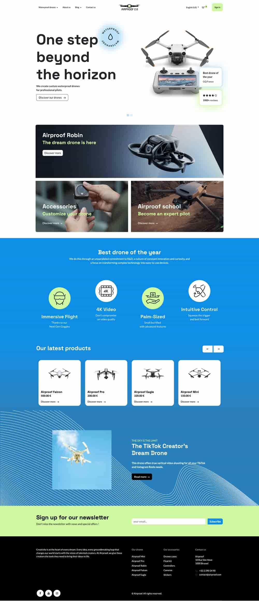
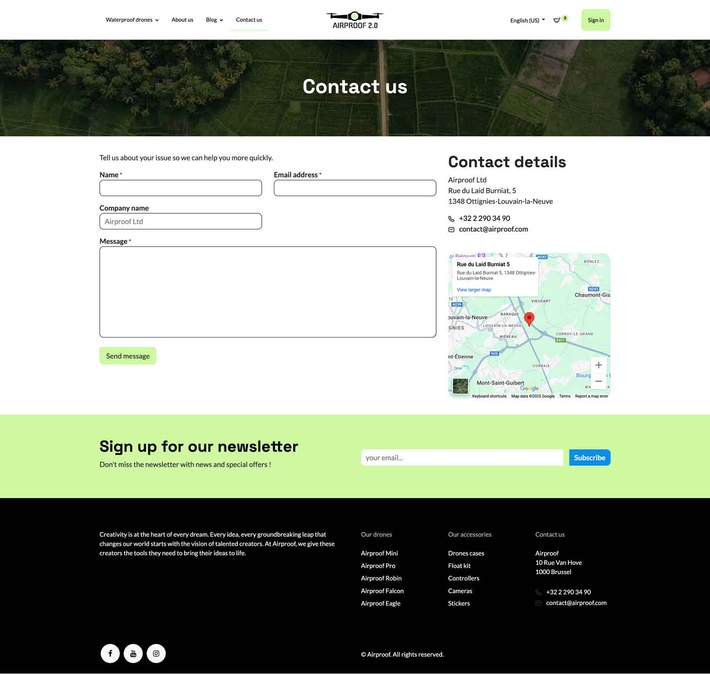
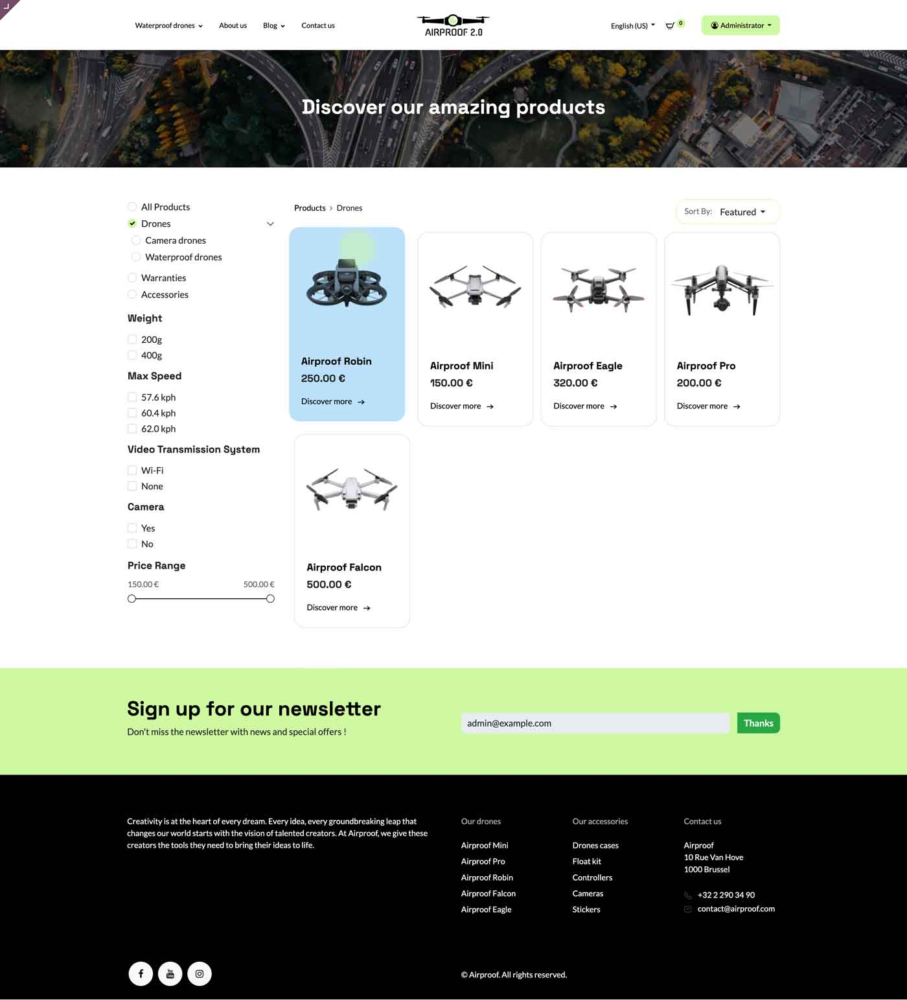
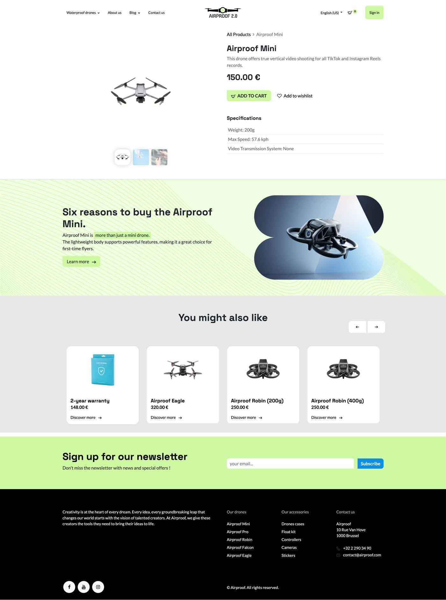

# Odoo Tutorial : Build a website theme

This branch contains the code necessary for the creation of the website for our Airproof example.
Example used to illustrate the exercises given in the Odoo tutorial: Build a website theme.

Here is the final design of the 4 pages of Airproof that will be created throughout this tutorial.

**Home**

**Contact page**

**Shop page**

**Product page**

